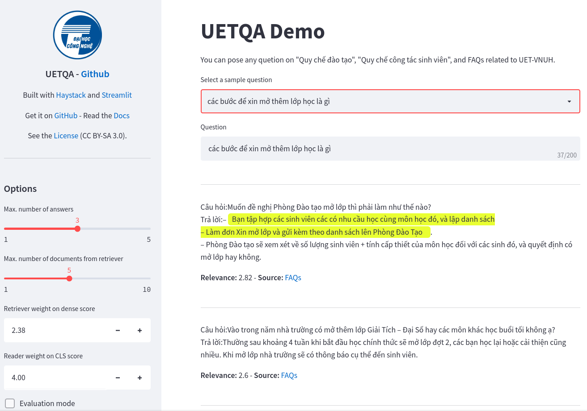

# UETQA

## About
UETQA is my undergraduate thesis project, a question answering or search system that can support UET students and staffs. It is capable of comprehending the text to extract the answers.

It relies on the knowledge base of school's regulation documents and FAQs to draw answers.
<!-- As the knowledge base expands, it should be able to answer a wider variety of questions. -->

To learn more about it, my thesis is accessible via this overleaf project: [overleaf.com/read/czdvtqwcpfpt](overleaf.com/read/czdvtqwcpfpt)


## Installation
On a new python or conda virtual environment is recommended
```
git clone <this repo>
cd uetqa
pip install -e .
```
OS: Linux preferably. The project is not built to run on Windows.


## Data
- knowledge base: `data/kb/`
- UETQA dataset: `data/uetqa*`
- dense retriever model: [ncthuan/vi-distilled-msmarco-MiniLM-L12-cos-v5](https://huggingface.co/ncthuan/vi-distilled-msmarco-MiniLM-L12-cos-v5)
- reader model: [ncthuan/xlm-l-uetqa](https://huggingface.co/ncthuan/xlm-l-uetqa)


## To run the demo

You 'll need Elasticsearch at port 9200, with index.


Here is my suggested commands to run the demo:
```
# run Elasticsearch
docker run --name uetqa-es -p 9200:9200 -e "discovery.type=single-node" elasticsearch:7.9.2

# prepare the index
python scripts/data/index_docs_es.py --input_dir data/kb/json/ \
  --dense_model_path ncthuan/vi-distilled-msmarco-MiniLM-L12-cos-v5 \
  --embedding_dim 384 \
  --max_seq_len 384 \
  --index_name uetqa-demo

# run the app
INDEX_NAME=uetqa-demo EMBEDDING_DIM=384 \
EMBEDDING_MODEL=ncthuan/vi-distilled-msmarco-MiniLM-L12-cos-v5 \
READER_MODEL=ncthuan/xlm-l-uetqa \
streamlit run scripts/demo.py --theme.base light
```
The app will be available at port 8501


